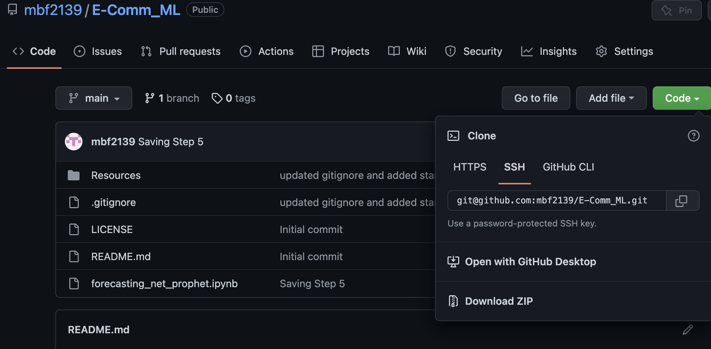

# E-Comm_ML

## Forecasting Search Traffic and Revenue with Prophet

---

### Technologies

This app leverages python 3.8 with the following technologies

* [pandas](https://github.com/pandas-dev/pandas) - For data analysis and manipulation.
* [numpy](https://github.com/numpy/numpy) - For scientific calculations with Python
* [pathlib](https://github.com/jazzband/pathlib2) - For file manipulation.
* [pyviz hvplot](https://github.com/pyviz/pyviz.org) - For interactive data visualizations 
* [holoviz/holoviews](https://github.com/holoviz/holoviews) - For data viz
* [pystan](https://github.com/stan-dev/pystan) - For statistical modeling
* [fbprophet](https://github.com/facebook/prophet) - For forecasting time series data 

---

## Installation 

1. Clone the repo 

2. Before running the program make sure to install the following dependencies:

            '''
            python
            pip install pathlib
            !pip install pystan
            !pip install fbprophet
            !pip install hvplot
            !pip install holoviews
            
            '''
 
 3. Data is contained in the ***Resources*** folder and intercangeable with data of user's choice '''
 
 --- 
 
 ## Usage
 
 1. To run the program navigate to the ***forecasting_net_prophet.ipynb*** file within the repo
 
 2. The program will import, clean and analyze the data provided
 
 3. The program will first analyze search trends and forecast near term site popularity
 
  4. The program will then analyze and forecast near term stock price using a Prophet model
 
 5. Lastly the program will return a forecast for company revenue in the next quarter 
 
 --- 
 
 ## Contributors

The starter code was contributed by the [FinTech Bootcamp at Columbia Engineering](https://bootcamp.cvn.columbia.edu/fintech/)

Matthew Field finalized the application, his work is availble to view on [Github](https://github.com/mbf2139)

---

## License

MIT